# Text-to-Speech Application

> A web-based Text-to-Speech platform built with React, Spring Boot, Spring Security, Azure Speech Services, AI-powered text enhancement, document text extraction, usage management, and administrative reporting.


---

# Overview

The **Text-to-Speech Application** is a full-stack web application that converts text into natural-sounding speech and provides users with a complete workflow for creating, managing, and consuming synthesized audio.

The application supports:

- Text-to-speech synthesis
- Multiple voices and languages
- Speech history
- Audio download
- Document text extraction
- AI-powered text enhancement
- Text summarization
- Text reduction
- Monthly usage limits
- Administrative usage metrics
- Speech request reporting
- User authentication and authorization

The application is designed around a service-oriented backend architecture with reusable platform infrastructure for security, request context, logging, exception handling, and REST communication.

---

# Features

## Text-to-Speech

- Text-to-speech synthesis
- Multiple languages
- Multiple Azure Neural voices
- Voice listing
- Audio response in MPEG format
- Configurable text length limits
- Separate limits for normal text and document text
- Audio download
- Speech history

## Document Processing

- Supported document type discovery
- Document upload
- Text extraction from supported documents
- Extracted text can be processed through the speech workflow

## AI Text Enhancement

The application provides AI-assisted text processing.

Supported operations include:

- **Enhance** — improve the input text
- **Reduce** — reduce text to a requested target length
- **Summarise** — generate a concise summary

The AI functionality is integrated into the speech workflow so users can prepare their text before synthesis.

## Authentication & Authorization

- User registration
- User login
- JWT-based authentication
- Access token management
- Refresh token management
- Logout
- Password changes
- User profile management
- Role-based authorization
- Administrative access control

The application currently supports:

```text
ADMIN
USER
```

## Usage Management

The application tracks speech usage on a monthly basis.

Usage management includes:

- Monthly character usage tracking
- Configurable monthly limits
- Remaining usage calculation
- Usage exhaustion handling
- Protection against requests exceeding the available usage
- Administrative usage reporting

## Speech History

Users can:

- View their speech history
- Download generated speech
- Delete speech history records

Administrators can access broader speech-history information for reporting and administration.

## Administrative Reporting

Administrative reporting includes:

- Usage metrics
- Speech history records
- User statistics
- Monthly user statistics
- Synthesis reports
- Monthly synthesis reports
- TTS request reports
- Monthly TTS request reports

# Architecture

The application follows a service-oriented architecture separating identity, speech transformation, and reporting responsibilities.

```xml
                         +---------------------------+
                         |        React Client       |
                         |       TypeScript UI       |
                         +-------------+-------------+
                                       |
                                       |
                                       v
                         +---------------------------+
                         |       Backend APIs        |
                         +-------------+-------------+
                                       |
                                       |
                      +----------------+------------------+
                      |                |                  |               
                      v                v                  v               
                  +-----------+   +-------------+   +-----------+
                  | Identity  |   |  Transform  |   |  Reports  |
                  | Service   |   |  Service    |   | Service   |
                  +-----------+   +-------------+   +-----------+
                  +---------------------------------------------+
                  |             Platform Modules                |
                  +---------------------------------------------+
                        |                |                |
                        v                v                v
                  +-----------+   +-------------+   +-----------+
                  | PostgreSQL|   | PostgreSQL  |   | Reporting |
                  |           |   |             |   | Data      |
                  +-----------+   +-------------+   +-----------+
                                        |
                          +-------------+-------------+
                          |                           |
                          v                           v
                  +------------------+       +------------------+
                  | Azure Speech     |       | Azure AI        |
                  | Services         |       | Services        |
                  +------------------+       +------------------+
                          |
                          v
                  Audio Storage
```

# Screenshots

Landing
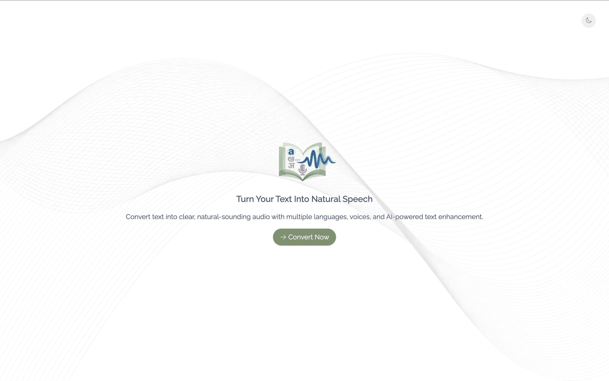
Login
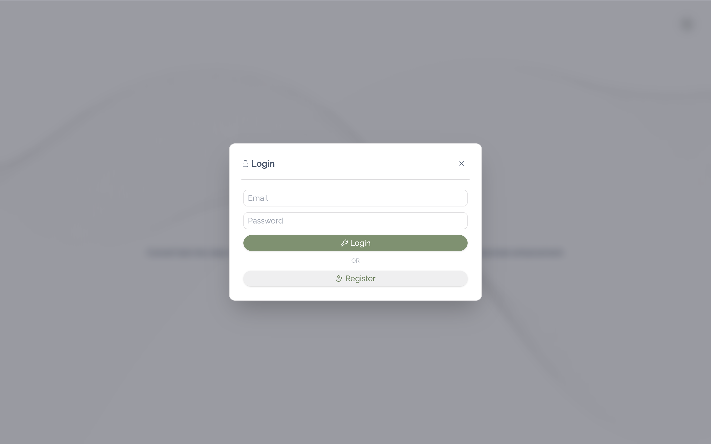
Admin Dashboard
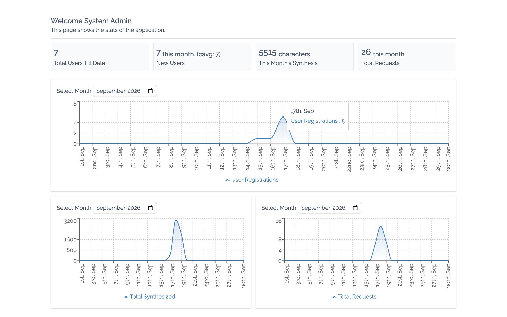
User Account
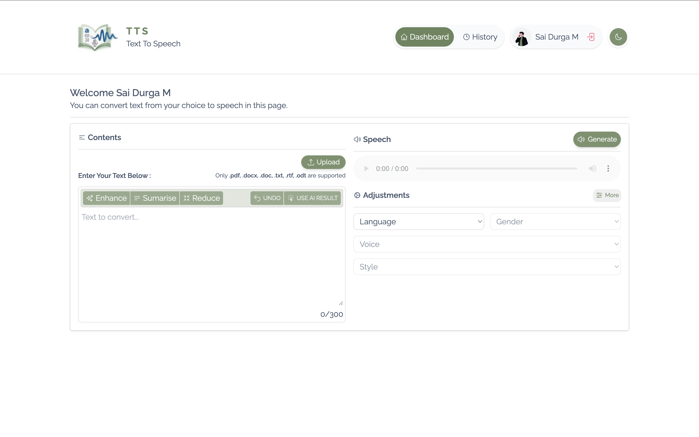
Doc Upload Prompt
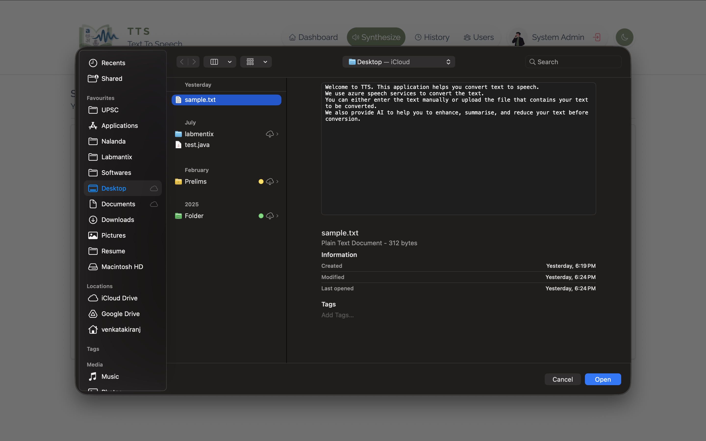
Input Validations
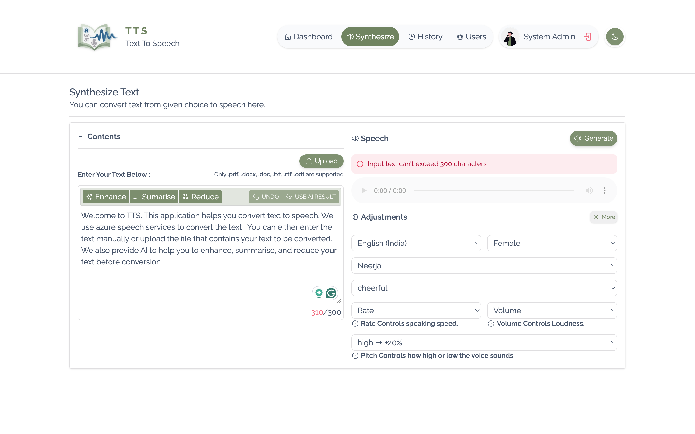
AI in action

Voices
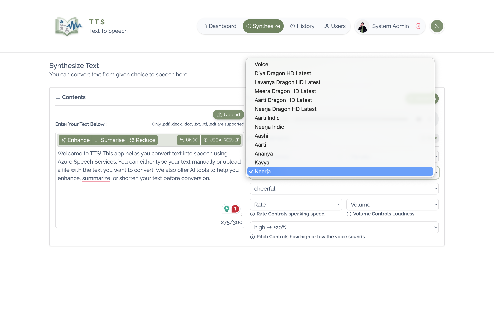
Synthesis Progress
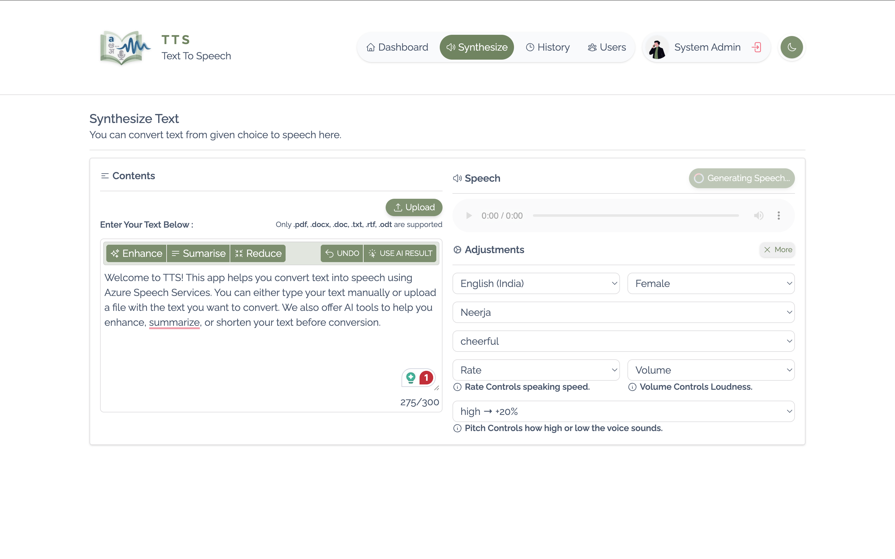
Synthesis Results
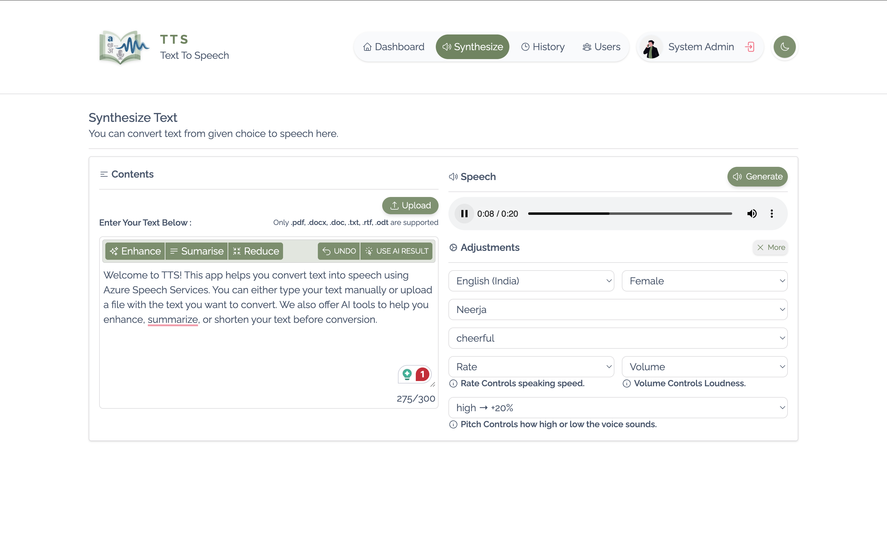
History
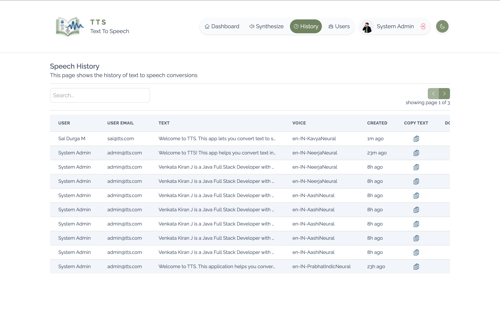
History Copy, Download, Delete
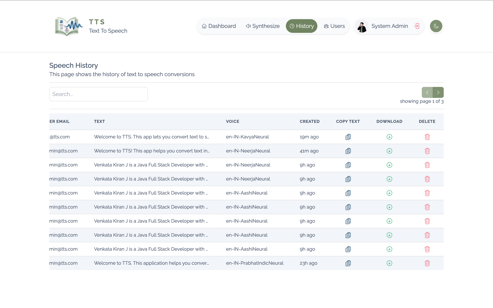

# Application Flow

## Text-to-Speech Flow

```text
User
 |
 | Enter text
 v
React Application
 |
 | POST /speech/api/v1/synthesize
 v
Transform Service
 |
 +---- Validate request
 |
 +---- Validate text length
 |
 +---- Check monthly usage
 |
 v
TTS Provider
 |
 | Azure Speech Services
 v
Generated Audio
 |
 v
Transform Service
 |
 +---- Save speech history
 |
 v
React Audio Player
```

## Authentication Flow

```
                     Login Request
                          |
                          v
                  +---------------+
                  |    Identity   |
                  |    Service    |
                  +-------+-------+
                          |
                          v
                  Validate Credentials
                          |
                          v
                  Access + Refresh
                      Tokens
                          |
                          v
                       Client
                          |
                          | Bearer Token
                          v
                  Protected APIs
```
The application uses JWT-based stateless authentication.

Authenticated requests use the bearer token to access protected resources.

## AI Enhancement Flow

```
User Text
    |
    v
React Application
    |
    | POST /speech/api/v1/ai/enhance
    v
AI Controller
    |
    +---- ENHANCE
    |
    +---- REDUCE
    |
    +---- SUMMARISE
    |
    v
AI Service
    |
    v
Enhanced Text
```
For the REDUCE operation, a target length is required.

## Document Processing Flow

```
Document
   |
   v
React Application
   |
   | Multipart Upload
   v
Document API
   |
   v
Document Service
   |
   +---- Validate File
   |
   +---- Identify Supported Type
   |
   +---- Extract Text
   |
   v
Extracted Text
   |
   v
Text-to-Speech / AI Processing
```

# Core Services

| Service           | Responsibility                                                                             |
| ----------------- | ------------------------------------------------------------------------------------------ |
| Identity Service  | Authentication, authorization, users, tokens, and profile management                       |
| Transform Service | Speech synthesis, speech history, document extraction, AI processing, and usage management |
| Reports Service   | Administrative analytics and reporting                                                     |
| Platform Modules  | Security, logging, request context, REST communication, and common web infrastructure      |


## Identity Service

The Identity Service manages users and authentication.

### Responsibilities
- User registration
- User creation
- User retrieval
- User updates
- User deletion
- User search
- Role management
- Login
- Logout
- Password changes
- Access-token generation
- Refresh-token management
- Current-user retrieval
- User lookup by ID

#### Authentication APIs

```
POST /identity/api/v1/auth/login
POST /identity/api/v1/auth/refresh
POST /identity/api/v1/auth/logout
```

#### User APIs

```
GET    /identity/api/v1/users/me
POST   /identity/api/v1/users/
POST   /identity/api/v1/users/register
GET    /identity/api/v1/users/
GET    /identity/api/v1/users/role/{role}
GET    /identity/api/v1/users/{id}
POST   /identity/api/v1/users/search
PUT    /identity/api/v1/users/{id}
PATCH  /identity/api/v1/users/
DELETE /identity/api/v1/users/{id}
```

## Transform Service

The Transform Service contains the primary text-processing and speech domain.

It is responsible for:

- Speech synthesis
- Voice discovery
- Speech downloads
- Speech history
- Document processing
- AI text enhancement
- Usage tracking
- Administrative transform-level reporting


### Speech APIs

#### Synthesize Speech

```
POST /speech/api/v1/synthesize
```

The endpoint accepts a synthesis request and returns generated audio.

Response:

```
Content-Type: audio/mpeg
```

#### Get Available Voices

```
GET /speech/api/v1/voices
```

Returns the voices available from the configured TTS provider.

Example:
```
en-US-JennyNeural
```

Download Speech
```
GET /speech/api/v1/{speechId}/download
```
Returns the generated speech audio.

### Speech History APIs
```
GET    /speech/api/v1/history/
DELETE /speech/api/v1/history/{speechId}
```
Users can retrieve and delete their speech history.

Administrative users can access broader history information according to their authorization.

### Document APIs
```
GET  /speech/api/v1/documents/support
POST /speech/api/v1/documents/extract
```
The first endpoint returns the supported document types.

The second accepts a multipart document and extracts its text.

### AI APIs
```
POST /speech/api/v1/ai/enhance
```
Supported enhancement operations:
```
ENHANCE
REDUCE
SUMMARISE
```
Example processing flow:
```
Original Text
     |
     +---- ENHANCE ------> Improved Text
     |
     +---- REDUCE -------> Reduced Text
     |
     +---- SUMMARISE ----> Summary
```

### Transform Reporting APIs

Administrative transform-level reporting endpoints include:

```
GET /speech/api/v1/reports/metrics
GET /speech/api/v1/reports/history
```

These endpoints are restricted to administrators.

## Reports Service

The Reports Service provides application-level reporting and analytics.

### User Reports
```
GET /reports/api/v1/speech/users
GET /reports/api/v1/speech/users/{month}
```

### Synthesis Reports
```
GET /reports/api/v1/speech/synthesis
GET /reports/api/v1/speech/synthesis/{month}
```

### Request Reports
```
GET /reports/api/v1/speech/requests
GET /reports/api/v1/speech/requests/{month}
```

All reporting endpoints require administrative authorization.

## Usage Management

Speech synthesis is protected by configurable usage limits.

The application tracks usage using a monthly usage model.
```
UsageMetrics
 |
 +-- ownerId
 +-- month
 +-- utilized
 +-- maxLimit
 +-- createdAt
 +-- updatedAt
```
Example:
```
Monthly Limit
      |
      v
10,000 characters
      |
      +-------------------+
      |                   |
      v                   v
 Utilized             Remaining
   6,500                3,500
```

Requests are rejected when the configured usage constraints are exceeded.

The relevant HTTP responses include:
```
429 Too Many Requests
413 Content Too Large
411 Length Required
```
Usage limits are configurable through application configuration.

# Technology Stack
| Layer             | Technology                  |
| ----------------- | --------------------------- |
| Backend           | Java 25                     |
| Framework         | Spring Boot                 |
| Security          | Spring Security             |
| Authentication    | JWT                         |
| Frontend          | React                       |
| Frontend Language | TypeScript                  |
| Database          | PostgreSQL                  |
| ORM               | Spring Data JPA / Hibernate |
| TTS Provider      | Azure Speech Services       |
| AI Processing     | Azure AI                    |
| API Documentation | Springdoc OpenAPI           |
| Build             | Maven                       |
| API Communication | REST                        |
| Audio Format      | MPEG                        |
| Version Control   | Git / GitHub                |


# Shared Platform Architecture

The application uses reusable platform components for common infrastructure concerns.

```
Platform
│
├── Web
│   └── Standardized Error Handling
│
├── Logging
│   ├── Request Context
│   ├── Correlation IDs
│   ├── Request Logging
│   ├── Response Logging
│   └── Exception Logging
│
├── Security
│   ├── JWT Resource Server
│   ├── Authentication Context
│   ├── Role-Based Authorization
│   └── Authenticated User Abstraction
│
└── RestClient
    ├── Request Context Propagation
    ├── Correlation ID Propagation
    └── Bearer Token Propagation
```
The shared platform separates common infrastructure from business functionality.

This allows individual services to focus on their respective business domains.

# Security Architecture

Security is implemented using Spring Security and JWT.

```
                     Login
                       |
                       v
               Identity Service
                       |
                       v
               Authenticate User
                       |
                       v
                JWT Tokens
                       |
                       v
                     Client
                       |
                       | Authorization: Bearer <token>
                       v
                Protected API
                       |
                       v
              Spring Security
                       |
                       v
             Authenticated User
```

## Security Features
- JWT-based authentication
- Stateless sessions
- Role-based authorization
- Protected endpoints
- Authentication context
- Method-level authorization
- Bearer-token propagation
- CORS configuration
- Centralized authentication error handling

Example authorization:
```c
@PreAuthorize("hasRole('ADMIN')")
```

# Request Context & Logging

The shared logging infrastructure provides request-level observability.

Supported capabilities include:

- Correlation ID generation
- Request logging
- Response logging
- Exception logging
- Request context propagation
- Rolling log files

Example:
```
Incoming Request
      |
      v
Correlation ID
      |
      v
Transform Service
      |
      | Downstream Request
      v
Identity / AI / TTS Provider
      |
      v
Response
```
A correlation identifier allows related operations to be traced across service boundaries.

# API Documentation

The backend uses **Springdoc OpenAPI** for API documentation.

Swagger/OpenAPI documentation provides:

- Endpoint discovery
- Request and response schemas
- Authentication configuration
- API testing
- HTTP response documentation
- Validation information

Protected APIs use bearer-token authentication through the configured OpenAPI security scheme.

# Error Handling

The application uses standardized API error handling across the backend.

Common HTTP responses include:
| Status | Meaning                                        |
| ------ | ---------------------------------------------- |
| 200    | Request completed successfully                 |
| 201    | Resource created                               |
| 204    | Request completed without response body        |
| 400    | Invalid request or validation failure          |
| 401    | Authentication required or invalid credentials |
| 403    | Access denied                                  |
| 404    | Resource not found                             |
| 411    | Required text length not satisfied             |
| 413    | Request exceeds configured size limit          |
| 429    | Usage limit exceeded                           |
| 503    | External service unavailable                   |

# Configuration

Application behavior is configurable through external configuration.

Important configuration areas include:

```yml
app:
  request:
    min-text-length: 55
    max-text-length: 200
    max-doctext-length: 500

  limits:
    max-monthly-limit: 10000
    max-overdraft-limit: 25.0
```
These properties control text validation and monthly usage behavior.

External provider configuration should be supplied through environment variables or secure configuration rather than committed directly to source control.

# Project Structure

The project is organized into business services and reusable infrastructure modules.
```
Text-to-Speech Application
│
├── platform
│   ├── web
│   ├── logging
│   ├── security
│   └── restclient
│
├── services
│   ├── identity
│   ├── transform
│   └── reports
│
├── ui
│   ├── components
│   ├── pages
│   ├── routes
│   ├── services
│   └── api
│
├── docs
│
└── README.md
```

# Database

PostgreSQL is used for persistent application data.

The data model includes entities for areas such as:
```
Identity
│
├── Users
├── Roles
└── Refresh Tokens

Transform
│
├── Speech History
└── Usage Metrics

Reports
│
└── Reporting / Aggregated Data
```
Speech history contains information required to associate generated audio with its owner and maintain the history of synthesis operations.

Usage metrics maintain monthly speech-character consumption.

# External Services

The application integrates with external cloud services for speech and AI processing.

## Azure Speech Services

Used for:

- Voice discovery
- Text-to-speech synthesis
- Neural voices
- Multiple languages

## Azure AI

Used for:

- Text enhancement
- Text reduction
- Text summarization

External credentials are expected to be supplied through secure application configuration.

# Testing

The project includes automated tests for controllers and service-layer functionality.

Testing covers areas including:

- Authentication
- User management
- Speech synthesis
- Voice retrieval
- Speech downloads
- Speech history
- History deletion
- Usage metrics
- Document processing
- AI enhancement
- Reporting APIs
- Validation scenarios
- Authorization scenarios

The test suite is built using the Spring testing ecosystem and JUnit-based tests.

Run backend tests with:

```xml
mvn test
```

# Running the Project
## Prerequisites

Install:

- Java 25+
- Maven
- Node.js
- npm
- PostgreSQL
- Azure Speech Services configuration
- Azure AI configuration

# Backend

Build the backend:

```
mvn clean install
```

Run the required services according to the project configuration.

For individual services:

```
mvn spring-boot:run
```

# Frontend

From the frontend directory:

```
npm install
npm run dev
```

The React application can then be accessed through the Vite development server.

# Environment Configuration

Provider credentials and environment-specific configuration should be supplied through environment variables or external configuration.

Typical configuration includes:

```
Azure Speech subscription key
Azure Speech region
Azure AI credentials
Database URL
Database username
Database password
JWT configuration
Storage configuration
```

Do not commit provider secrets, database passwords, private keys, or JWT secrets to the repository.

# Typical User Flow

```
                    +----------------+
                    |     Login      |
                    +-------+--------+
                            |
                            v
                    +---------------+
                    |   Dashboard   |
                    +-------+-------+
                            |
              +-------------+-------------+
              |             |             |
              v             v             v
           Text Input   Document      History
              |          Upload           |
              v             |             |
           AI Enhance       |             |
              |             v             |
              +-------> Extract Text      |
                            |             |
                            +------+------+
                                   |
                                   v
                              Synthesize
                                   |
                                   v
                            Azure Speech
                                   |
                                   v
                              Audio File
                                   |
                    +--------------+--------------+
                    |                             |
                    v                             v
                 Play Audio                   Download
                    |
                    v
               Save History
```

# Design Principles

The application follows the following engineering principles:

- Separation of Concerns
- Single Responsibility Principle
- Domain-oriented service decomposition
- Loose Coupling
- High Cohesion
- Stateless Authentication
- Role-Based Authorization
- Reusable Platform Infrastructure
- Centralized Exception Handling
- Centralized Logging
- Request Context Propagation
- Secure External Service Integration
- Configuration-driven Application Behavior
- RESTful API Design
- Constructor-based Dependency Injection
- Spring Boot Auto-Configuration
- Automated Testing

# Future Enhancements

Potential future improvements include:

- Kubernetes deployment
- Docker-based deployment
- CI/CD pipeline
- Distributed tracing
- Centralized monitoring
- Additional TTS providers
- Additional AI providers
- Advanced speech customization
- More document formats
- Favorite speech records
- Advanced analytics
- Usage dashboards
- Cloud object storage
- Scalable audio processing
- Asynchronous speech processing
- Notification support
- Improved audio management

# License

This project is developed as a full-stack software engineering project for learning, experimentation, and demonstration of modern Java, Spring Boot, React, cloud-service integration, and distributed application development.

# Author
Developed to demonstrate enterprise application development using Spring Boot, Spring Cloud, React, and microservices architecture.

**Venkata Kiran J** - [Connect with me on LinkedIn](https://www.linkedin.com/in/venkata-kiran-jakkapu-a2209415a/)