# Text-to-Speech Application

> A cloud-ready, microservices-based Text-to-Speech platform built with Java, Spring Boot, Spring Cloud, React, PostgreSQL, Azure Speech Services, Azure Blob Storage, and Azure OpenAI.


---

# Overview

The **Text-to-Speech Application** is a full-stack, cloud-integrated application that converts text into natural-sounding speech while providing additional capabilities for document processing, AI-powered text transformation, speech history, usage management, and administrative reporting.

The application is built using a **microservices architecture** with dedicated services for identity management, text transformation, and reporting.

The backend is supported by a dedicated cloud infrastructure layer consisting of:

- Spring Cloud Config Server
- Netflix Eureka Service Registry
- Spring Cloud API Gateway
- Reusable platform modules
- PostgreSQL databases
- Azure Speech Services
- Azure Blob Storage
- Azure OpenAI

The frontend is implemented as a React application that communicates with the backend through the API Gateway.

---

# Key Features

## Text-to-Speech

- Text-to-speech synthesis
- Multiple languages
- Azure Neural voices
- Voice discovery
- Audio generation
- MPEG audio responses
- Configurable text limits
- Speech history
- Audio download

## Document Processing

- Supported document type discovery
- Multipart document upload
- Document text extraction
- Apache Tika-based document processing
- Extracted text integration with the speech workflow

## AI Text Processing

The application supports AI-powered text transformation:

- **Enhance** — improve the supplied text
- **Reduce** — reduce text to a requested target length
- **Summarise** — generate a concise summary

AI processing is integrated into the text-to-speech workflow.

## Authentication & Authorization

- User registration
- User login
- JWT authentication
- Access tokens
- Refresh tokens
- Logout
- Password management
- User profile management
- Role-based authorization
- Administrative authorization

Supported roles:

```text
ADMIN
USER
```

## Speech History

Users can:

- View their speech history
- Download generated audio
- Delete speech history records

## Usage Management

The application maintains monthly speech usage.

Usage management includes:

- Character utilization tracking
- Monthly limits
- Remaining usage calculation
- Usage exhaustion handling
- Configurable limits
- Administrative usage reporting

## Administrative Reporting

The reporting layer provides information including:

- Usage metrics
- Speech history
- User statistics
- Monthly user statistics
- Synthesis statistics
- Monthly synthesis statistics
- TTS request statistics
- Monthly TTS request statistics

---

# System Architecture

The application follows a **microservices architecture** with a dedicated cloud infrastructure layer.

```text
                                      +----------------------+
                                      |      React UI        |
                                      |   React + TypeScript |
                                      +----------+-----------+
                                                 |
                                                 v
                                      +----------------------+
                                      |     API Gateway      |
                                      |  Spring Cloud Gateway|
                                      +----------+-----------+
                                                 |
                         +-----------------------+-----------------------+
                         |                       |                       |
                         v                       v                       v
                +----------------+     +-------------------+     +----------------+
                | Identity       |     | Transformer       |     | Reports        |
                | Service        |     | Service           |     | Service        |
                +-------+--------+     +---------+---------+     +-------+--------+
                        |                        |                       |
                        v                        v                       |
                +---------------+        +---------------+               |
                | PostgreSQL    |        | PostgreSQL    |               |
                | Identity DB   |        | Transform DB  |               |
                +---------------+        +---------------+               |
                                                 |
                         +-----------------------+----------------+
                         |                       |                |
                         v                       v                v
                +----------------+     +----------------+  +----------------+
                | Azure Speech   |     | Azure Blob     |  | Azure OpenAI   |
                | Services       |     | Storage        |  |                |
                +----------------+     +----------------+  +----------------+
```

The architecture separates:

1. Client layer
2. API Gateway layer
3. Business service layer
4. Shared platform layer
5. Cloud infrastructure layer
6. Data layer
7. External cloud service layer

---

# Cloud Architecture

The cloud infrastructure is a major part of the application's architecture.

```text
                         +-------------------------+
                         |      Config Server      |
                         |        :8888            |
                         +------------+------------+
                                      |
                                      | Centralized Configuration
                                      |
              +-----------------------+-----------------------+
              |                       |                       |
              v                       v                       v
       +-------------+        +-------------+        +-------------+
       |   Identity  |        | Transformer |        |   Reports   |
       |   Service   |        |   Service   |        |   Service   |
       +------+------+        +------+------+        +------+------+
              |                       |                       |
              +-----------------------+-----------------------+
                                      |
                                      | Service Discovery
                                      v
                            +------------------+
                            | Eureka Registry  |
                            |      :8761       |
                            +--------+---------+
                                     |
                                     v
                            +------------------+
                            |   API Gateway    |
                            |      :9090       |
                            +------------------+
```

The cloud layer provides three infrastructure services:

| Component | Responsibility | Port |
| --- | --- | ---: |
| Config Server | Centralized configuration | 8888 |
| Eureka Server | Service discovery and registration | 8761 |
| API Gateway | External API entry point and routing | 9090 |

---

# Config Server

The application uses **Spring Cloud Config Server** for centralized configuration.

```text
                     Config Server
                          |
        +-----------------+------------------+
        |                 |                  |
        v                 v                  v
 Identity Config    Transform Config    Reports Config
        |                 |                  |
        +-----------------+------------------+
                          |
                     Common Config
```

The configuration repository contains:

```text
cloud/repo/
│
├── application.yml
├── tts-api-gateway.yml
├── tts-identity-service.yml
├── tts-transformer-service.yml
└── tts-reports-service.yml
```

Common configuration includes:

- Eureka configuration
- Service URLs
- Security configuration
- JWT configuration
- Logging configuration
- REST client propagation
- CORS configuration
- Actuator configuration

Service-specific configuration includes:

- Database configuration
- Multipart limits
- Azure Speech configuration
- Azure Blob Storage configuration
- Azure OpenAI configuration
- Application-specific limits

The Config Server runs on:

```text
http://localhost:8888
```

---

# Service Discovery

The application uses **Netflix Eureka** for service discovery.

```text
                       +------------------+
                       | Eureka Registry  |
                       |      :8761       |
                       +--------+---------+
                                |
              +-----------------+-----------------+
              |                 |                 |
              v                 v                 v
       Identity Service   Transform Service   Reports Service
```

Business services register themselves with Eureka.

The API Gateway uses Eureka service names to dynamically locate service instances.

The Eureka server runs on:

```text
http://localhost:8761
```

---

# API Gateway

The application uses **Spring Cloud Gateway** as the external entry point for backend APIs.

```text
                    React Client
                         |
                         v
                  +-------------+
                  | API Gateway |
                  |    :9090    |
                  +------+------+
                         |
          +--------------+--------------+
          |              |              |
          v              v              v
     /identity/**    /speech/**    /reports/**
          |              |              |
          v              v              v
      Identity       Transform       Reports
      Service        Service         Service
```

Gateway routes are configured using Eureka load-balanced service names:

```text
/identity/**  →  lb://tts-identity-service

/speech/**    →  lb://tts-transformer-service

/reports/**   →  lb://tts-reports-service
```

This means the gateway does not depend on hard-coded backend service addresses.

The API Gateway runs on:

```text
http://localhost:9090
```

---

# Business Services

The application contains three business services.

| Service | Responsibility |
| --- | --- |
| Identity Service | Authentication, authorization, users, roles, and tokens |
| Transform Service | TTS, AI processing, document extraction, history, and usage |
| Reports Service | Administrative reporting and analytics |

---

# Identity Service

The Identity Service manages application users and authentication.

## Responsibilities

- User registration
- User creation
- User retrieval
- User updates
- User deletion
- User search
- Role management
- Login
- Logout
- Password changes
- Access-token generation
- Refresh-token management
- Current-user retrieval
- User lookup by ID

## Authentication APIs

```text
POST /identity/api/v1/auth/login
POST /identity/api/v1/auth/refresh
POST /identity/api/v1/auth/logout
```

## User APIs

```text
GET    /identity/api/v1/users/me
POST   /identity/api/v1/users/
POST   /identity/api/v1/users/register
GET    /identity/api/v1/users/
GET    /identity/api/v1/users/role/{role}
GET    /identity/api/v1/users/{id}
POST   /identity/api/v1/users/search
PUT    /identity/api/v1/users/{id}
PATCH  /identity/api/v1/users/
DELETE /identity/api/v1/users/{id}
```

---

# Transform Service

The Transform Service is the core business service of the application.

It handles:

- Text-to-speech
- Voice discovery
- Speech history
- Audio download
- Document extraction
- AI text processing
- Usage tracking
- Administrative transform reporting

The service integrates with multiple external cloud capabilities.

```text
                    Transform Service
                           |
          +----------------+----------------+
          |                |                |
          v                v                v
   Azure Speech       Azure Blob       Azure OpenAI
     Services           Storage
```

---

# Reports Service

The Reports Service provides administrative reporting and analytics.

The service communicates with other application services when information required for reporting is owned by another domain.

```text
                    Reports Service
                           |
                +----------+----------+
                |                     |
                v                     v
        Identity Service       Transform Service
                |                     |
                +----------+----------+
                           |
                           v
                    Report Response
```

Reports include:

- User reports
- Monthly user reports
- Synthesis reports
- Monthly synthesis reports
- TTS request reports
- Monthly TTS request reports

---

# Shared Platform Architecture

The application includes reusable platform modules that provide infrastructure functionality shared across services.

```text
                       Labmantix Platform
                              |
          +-------------------+-------------------+
          |                   |                   |
          v                   v                   v
        Web                Logging             Security
          |                   |                   |
          +-------------------+-------------------+
                              |
                              v
                         RestClient
```

## Web Module

Provides:

- Standardized API error responses
- Validation error handling
- Common exception handling
- HTTP error mapping
- Extensible application error definitions

## Logging Module

Provides:

- Request logging
- Response logging
- Exception logging
- Correlation IDs
- Request context
- Rolling file logging

## Security Module

Provides:

- JWT resource-server integration
- Stateless authentication
- Authentication context
- Authenticated-user abstraction
- Role-based authorization
- JWT claim mapping
- CORS configuration
- Authentication and authorization error handling

## RestClient Module

Provides:

- Request-context propagation
- Correlation ID propagation
- Bearer-token propagation

---

# Inter-Service Communication

Business services communicate through HTTP APIs.

The shared RestClient platform automatically propagates important request information.

```text
                  Incoming Request
                         |
                         v
                 +---------------+
                 | Request       |
                 | Context       |
                 +-------+-------+
                         |
              +----------+----------+
              |                     |
              v                     v
       Correlation ID          Bearer Token
              |                     |
              +----------+----------+
                         |
                         v
                 Business Service
                         |
                         | REST
                         v
                 Downstream Service
                         |
                         +---- X-Correlation-Id
                         |
                         +---- Authorization: Bearer <token>
```

This allows downstream requests to retain:

- Authentication context
- Correlation ID
- Request context

---

# External Cloud Architecture

The Transform Service integrates with three major cloud capabilities.

```text
                       Transform Service
                              |
             +----------------+----------------+
             |                |                |
             v                v                v
    +----------------+ +---------------+ +----------------+
    | Azure Speech   | | Azure Blob    | | Azure OpenAI  |
    | Services       | | Storage       | |                |
    +----------------+ +---------------+ +----------------+
             |                |                |
             v                v                v
        Speech Audio       Audio Storage      AI Text
```

## Azure Speech Services

Used for:

- Voice listing
- Neural voice synthesis
- Multiple languages
- Audio generation

Configuration:

```yaml
azure:
  speech:
    key: ${AZURE_SPEECH_KEY}
    region: ${AZURE_SPEECH_REGION}
```

## Azure Blob Storage

Generated speech audio is stored using Azure Blob Storage.

Configuration:

```yaml
azure:
  storage:
    connection-string: ${AZURE_STORAGE_CONNECTION_STRING}
    container-name: ${AZURE_STORAGE_CONTAINER}
```

The application separates:

```text
Speech Metadata
      |
      v
PostgreSQL

Speech Audio
      |
      v
Azure Blob Storage
```

## Azure OpenAI

The application uses Azure OpenAI for AI-powered text processing.

Configuration:

```yaml
azure:
  openai:
    endpoint: ${AZURE_OPENAI_ENDPOINT}
    api-key: ${AZURE_OPENAI_API_KEY}
    deployment: ${AZURE_OPENAI_DEPLOYMENT}
```

Supported operations include:

```text
ENHANCE
REDUCE
SUMMARISE
```

---

# Data Architecture

The application uses PostgreSQL for persistent business data.

The current architecture separates databases by business service.

```text
                    PostgreSQL
                        |
          +-------------+-------------+
          |                           |
          v                           v
    tts_identity               tts_transformer
          |                           |
          v                           v
   Identity Data              Transform Data
```

## Identity Database

Contains identity-domain information such as:

- Users
- Roles
- Addresses
- Refresh tokens

## Transform Database

Contains transform-domain information such as:

- Speech history
- Usage metrics

## Audio Storage

Audio content is stored separately from relational metadata.

```text
Speech History
      |
      +---- Metadata ------> PostgreSQL
      |
      +---- Audio ---------> Azure Blob Storage
```

This separates transactional metadata from binary audio content.

---

# Application Flows

## Complete Text-to-Speech Flow

```text
User
 |
 v
React Application
 |
 | Text + Voice + Language
 v
API Gateway
 |
 | /speech/**
 v
Transform Service
 |
 +---- Validate Request
 |
 +---- Validate Text Length
 |
 +---- Check Monthly Usage
 |
 v
Azure Speech Services
 |
 | Generated Audio
 v
Transform Service
 |
 +---- Upload Audio
 |       |
 |       v
 |   Azure Blob Storage
 |
 +---- Save Speech History
 |       |
 |       v
 |   PostgreSQL
 |
 v
React Application
 |
 +---- Play Audio
 |
 +---- Download Audio
```

---

# Authentication Flow

```text
                         Login
                           |
                           v
                   +---------------+
                   | Identity      |
                   | Service       |
                   +-------+-------+
                           |
                           v
                   Validate Credentials
                           |
                           v
                    JWT Access Token
                    Refresh Token
                           |
                           v
                         Client
                           |
                           | Bearer Token
                           v
                      API Gateway
                           |
                           v
                   Protected Service
                           |
                           v
                   Spring Security
                           |
                           v
                 Authenticated User
```

The application uses stateless JWT authentication.

Configured token lifetimes:

```text
Access Token   : 2 hours
Refresh Token  : 7 days
```

---

# AI Processing Flow

```text
User Text
    |
    v
React Application
    |
    v
API Gateway
    |
    v
Transform Service
    |
    +---- ENHANCE
    |
    +---- REDUCE
    |
    +---- SUMMARISE
    |
    v
Azure OpenAI
    |
    v
Processed Text
    |
    v
React Application
```

For `REDUCE`, a target text length is required.

---

# Document Processing Flow

```text
Document
   |
   v
React Application
   |
   | Multipart Request
   v
API Gateway
   |
   v
Transform Service
   |
   +---- Validate File
   |
   +---- Identify Document Type
   |
   +---- Apache Tika
   |
   v
Extracted Text
   |
   +----------+
   |          |
   v          v
 AI Processing
              |
              v
        Text-to-Speech
```

Supported document types are exposed through the document API.

---

# Usage Management

Speech synthesis is protected by configurable monthly usage limits.

```text
                   Usage Metrics
                        |
            +-----------+-----------+
            |                       |
            v                       v
        Utilized                Max Limit
          6500                    10000
            |
            v
         Remaining
           3500
```

Example configuration:

```yaml
app:
  limits:
    max-monthly-limit: 10000
    max-overdraft-limit: 25.0
```

Text validation is also configurable:

```yaml
app:
  request:
    min-text-length: 55
    max-text-length: 300
    max-doctext-length: 300
```

Relevant responses include:

```text
411 Length Required
413 Content Too Large
429 Too Many Requests
```

---

# Security Architecture

Security is implemented using Spring Security and JWT.

The shared security module provides:

- JWT resource-server support
- Stateless authentication
- Role-based authorization
- Authentication context
- Authenticated-user abstraction
- Configurable JWT claims
- CORS support
- Authentication error handling

JWT roles are mapped using:

```text
roles
```

with the authority prefix:

```text
ROLE_
```

Example:

```java
@PreAuthorize("hasRole('ADMIN')")
```

---

# API Gateway Routing

The gateway exposes three major API domains:

```text
                    API Gateway
                       :9090
                         |
        +----------------+----------------+
        |                |                |
        v                v                v
   /identity/**      /speech/**      /reports/**
        |                |                |
        v                v                v
    Identity         Transform        Reports
    Service          Service          Service
```

This provides a single backend entry point for the React application.

---

# API Overview

## Identity

```text
POST   /identity/api/v1/auth/login
POST   /identity/api/v1/auth/refresh
POST   /identity/api/v1/auth/logout

GET    /identity/api/v1/users/me
POST   /identity/api/v1/users/
POST   /identity/api/v1/users/register
GET    /identity/api/v1/users/
GET    /identity/api/v1/users/role/{role}
GET    /identity/api/v1/users/{id}
POST   /identity/api/v1/users/search
PUT    /identity/api/v1/users/{id}
PATCH  /identity/api/v1/users/
DELETE /identity/api/v1/users/{id}
```

## Speech

```text
POST   /speech/api/v1/synthesize
GET    /speech/api/v1/voices
GET    /speech/api/v1/{speechId}/download
```

## History

```text
GET    /speech/api/v1/history/
DELETE /speech/api/v1/history/{speechId}
```

## Documents

```text
GET    /speech/api/v1/documents/support
POST   /speech/api/v1/documents/extract
```

## AI

```text
POST   /speech/api/v1/ai/enhance
```

## Transform Reports

```text
GET    /speech/api/v1/reports/metrics
GET    /speech/api/v1/reports/history
```

## Reports

```text
GET    /reports/api/v1/speech/users
GET    /reports/api/v1/speech/users/{month}

GET    /reports/api/v1/speech/synthesis
GET    /reports/api/v1/speech/synthesis/{month}

GET    /reports/api/v1/speech/requests
GET    /reports/api/v1/speech/requests/{month}
```

---

# API Documentation

The application uses **Springdoc OpenAPI**.

Swagger/OpenAPI provides:

- Endpoint documentation
- Request schemas
- Response schemas
- Validation documentation
- Error response documentation
- Bearer authentication
- Interactive API testing

Each backend service maintains its own OpenAPI configuration.

---

# Error Handling

The application provides standardized API error handling.

| Status | Meaning |
| --- | --- |
| 200 | Request completed successfully |
| 201 | Resource created |
| 204 | Request completed without response body |
| 400 | Invalid request or validation failure |
| 401 | Authentication required |
| 403 | Access denied |
| 404 | Resource not found |
| 411 | Text length requirement not satisfied |
| 413 | Request exceeds configured limit |
| 429 | Usage limit exceeded |
| 503 | External service unavailable |

---

# Observability

The shared logging platform provides centralized operational logging.

Capabilities include:

- Request logging
- Response logging
- Exception logging
- Correlation IDs
- Request context
- Rolling log files

Configured logging limits include:

```text
Maximum file size : 50 MB
Maximum history   : 30 files
Total size cap    : 512 MB
```

Correlation IDs allow related requests to be traced across service boundaries.

---

# Technology Stack

| Layer | Technology |
| --- | --- |
| Language | Java 25 |
| Backend | Spring Boot 4.1.1 |
| Cloud | Spring Cloud 2025.1.3 |
| Security | Spring Security + JWT |
| Gateway | Spring Cloud Gateway |
| Service Discovery | Netflix Eureka |
| Configuration | Spring Cloud Config |
| Database | PostgreSQL |
| ORM | Spring Data JPA / Hibernate |
| Frontend | React |
| Frontend Language | TypeScript |
| TTS | Azure Speech Services |
| Object Storage | Azure Blob Storage |
| AI | Azure OpenAI |
| Document Processing | Apache Tika |
| API Documentation | Springdoc OpenAPI |
| Build | Maven |
| API Communication | REST |
| Version Control | Git / GitHub |

---

# Project Structure

```text
Text-to-Speech Application
│
├── platform
│   ├── web
│   ├── logging
│   ├── security
│   └── restclient
│
├── cloud
│   ├── configserver
│   ├── eurekaserver
│   ├── apigateway
│   └── repo
│       ├── application.yml
│       ├── tts-api-gateway.yml
│       ├── tts-identity-service.yml
│       ├── tts-transformer-service.yml
│       └── tts-reports-service.yml
│
├── services
│   ├── identity
│   ├── transform
│   └── reports
│
├── ui
│
├── docs
│   └── images
│
└── pom.xml
```

---

# Maven Architecture

The root Maven project manages three major areas:

```text
                    TTS Parent POM
                         |
          +--------------+--------------+
          |              |              |
          v              v              v
      Platform          Cloud         Services
          |              |              |
          v              v              v
       Shared       Config Server     Identity
       Modules      Eureka Server     Transform
                    API Gateway       Reports
```

The root project manages common dependency and plugin versions.

---

# Service Ports

| Component | Port |
| --- | ---: |
| Config Server | 8888 |
| Eureka Server | 8761 |
| API Gateway | 9090 |
| Transform Service | 8081 |
| Reports Service | 8082 |
| Identity Service | Configured through service configuration |
| PostgreSQL | 5432 |
| React UI | 5173 |

---

# Configuration

Centralized configuration is maintained under:

```text
cloud/repo/
```

Example common configuration:

```yaml
services:
  uri:
    identity: http://tts-identity-service/identity/api/v1
    transform: http://tts-transformer-service/speech/api/v1
    reports: http://tts-reports-service/reports/api/v1
```

Eureka configuration:

```yaml
eureka:
  client:
    register-with-eureka: true
    fetch-registry: true
```

---

# Environment Variables

External credentials are supplied through environment variables.

Typical configuration includes:

```text
AZURE_SPEECH_KEY
AZURE_SPEECH_REGION

AZURE_STORAGE_CONNECTION_STRING
AZURE_STORAGE_CONTAINER

AZURE_OPENAI_ENDPOINT
AZURE_OPENAI_API_KEY
AZURE_OPENAI_DEPLOYMENT
```

Database and JWT configuration should also be supplied through secure environment-specific configuration.

> Do not commit API keys, connection strings, passwords, JWT secrets, or other credentials to source control.

---

# Testing

The project includes unit and controller-level automated tests across the services.

Testing covers:

- Authentication
- JWT handling
- User management
- Speech synthesis
- Voice retrieval
- Speech downloads
- Speech history
- History deletion
- Usage metrics
- Azure Speech integration
- Azure Blob Storage integration
- Azure OpenAI integration
- Document extraction
- AI enhancement
- Reports
- Authorization
- Validation
- Exception handling

Run the complete Maven test suite:

```bash
mvn test
```

Build the complete project:

```bash
mvn clean install
```

---

# Running the Application

## Prerequisites

Install:

- Java 25+
- Maven
- Node.js
- npm
- PostgreSQL
- Azure Speech Services
- Azure Blob Storage
- Azure OpenAI

---

# Recommended Startup Order

Because the application uses centralized configuration and service discovery, the recommended startup order is:

```text
1. PostgreSQL
      |
      v
2. Config Server
      |
      v
3. Eureka Server
      |
      v
4. API Gateway
      |
      v
5. Identity Service
      |
      v
6. Transform Service
      |
      v
7. Reports Service
      |
      v
8. React UI
```

The Config Server should be available before services attempt to load centralized configuration.

Eureka should be available before services register themselves and before the API Gateway performs service discovery.

---

# Start Cloud Infrastructure

## Config Server

```bash
cd cloud/configserver
mvn spring-boot:run
```

Runs on:

```text
http://localhost:8888
```

## Eureka Server

```bash
cd cloud/eurekaserver
mvn spring-boot:run
```

Runs on:

```text
http://localhost:8761
```

## API Gateway

```bash
cd cloud/apigateway
mvn spring-boot:run
```

Runs on:

```text
http://localhost:9090
```

---

# Start Backend Services

Identity:

```bash
cd services/identity
mvn spring-boot:run
```

Transform:

```bash
cd services/transform
mvn spring-boot:run
```

Reports:

```bash
cd services/reports
mvn spring-boot:run
```

---

# Start Frontend

From the UI directory:

```bash
npm install
npm run dev
```

The React development server runs on the configured Vite development port.

---

# Typical End-to-End Flow

```text
                         USER
                          |
                          v
                    React Application
                          |
                          v
                    API Gateway
                      :9090
                          |
          +---------------+---------------+
          |               |               |
          v               v               v
      Identity        Transform        Reports
       Service         Service         Service
          |               |
          |               |
          v               +-------------------------+
      PostgreSQL          |            |            |
                          v            v            v
                     Azure Speech   Azure Blob   Azure OpenAI
                       Services      Storage
```

This architecture allows the application to separate authentication, transformation, reporting, infrastructure, persistence, and external cloud integrations.

---

# Screenshots

Application screenshots are maintained under:

```text
docs/images/
```

## Landing Page

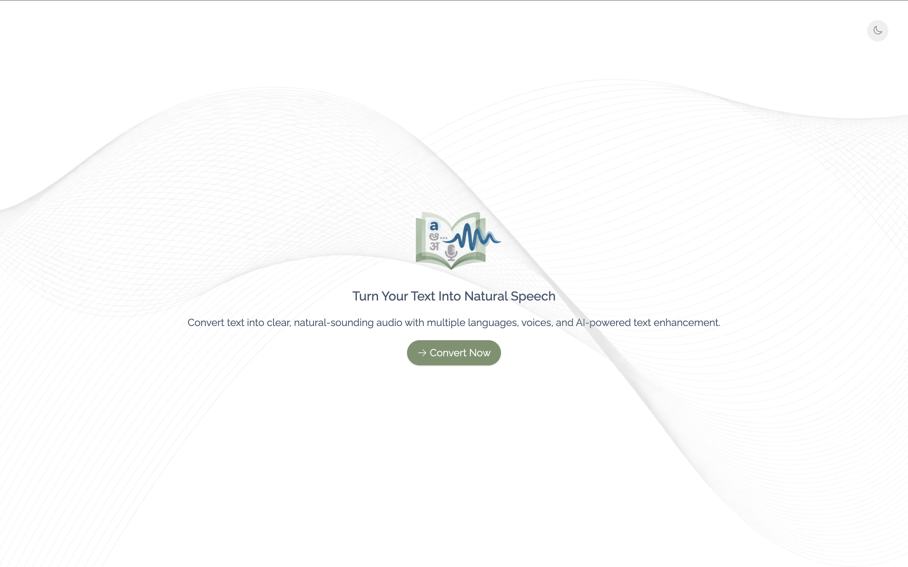

## Login

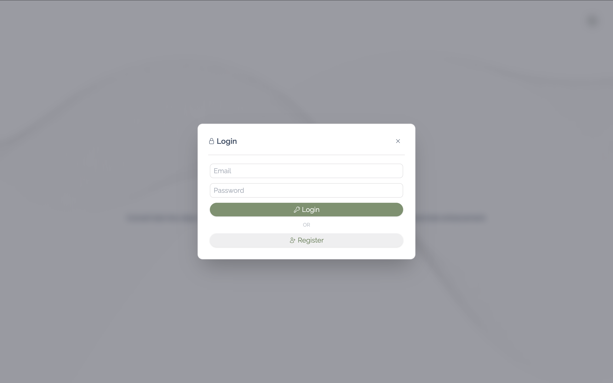

## Admin Dashboard

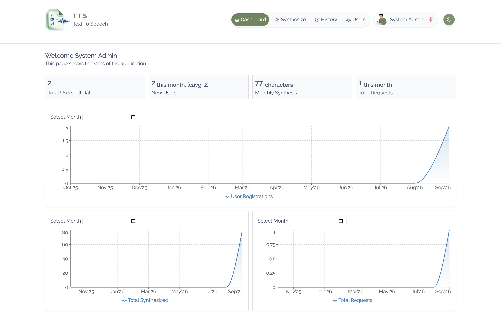

## User Account

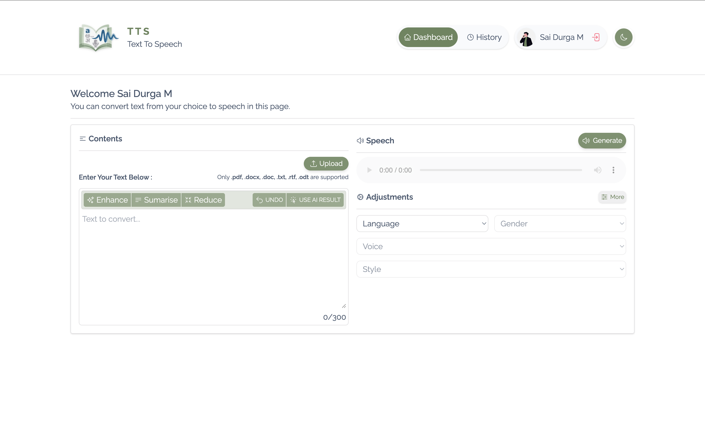

## Document Upload

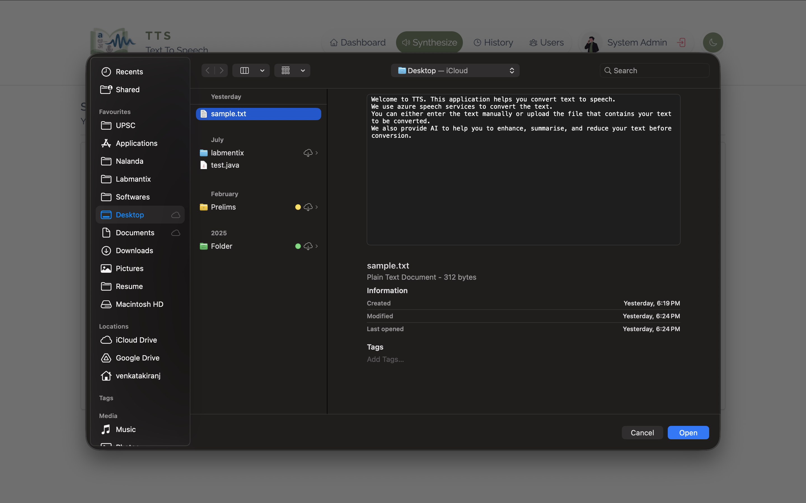

## Input Validation

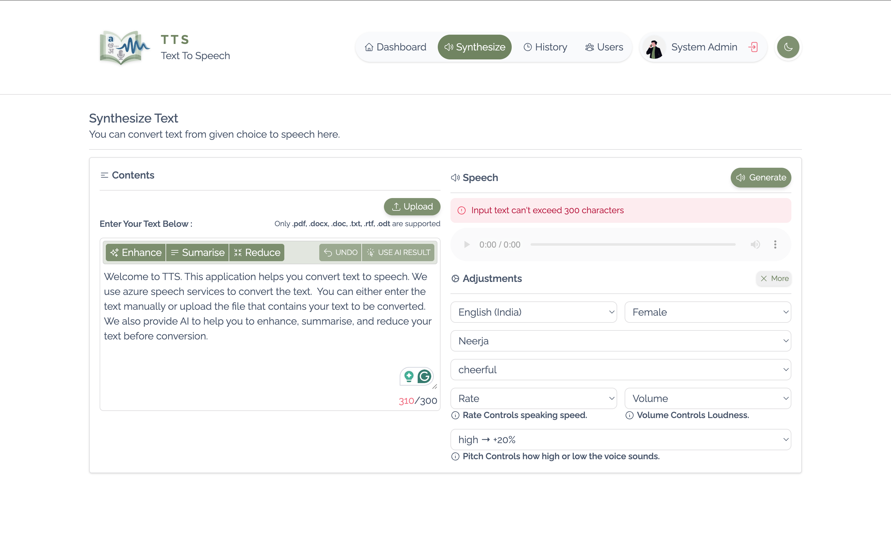

## AI Enhancement


## Voices

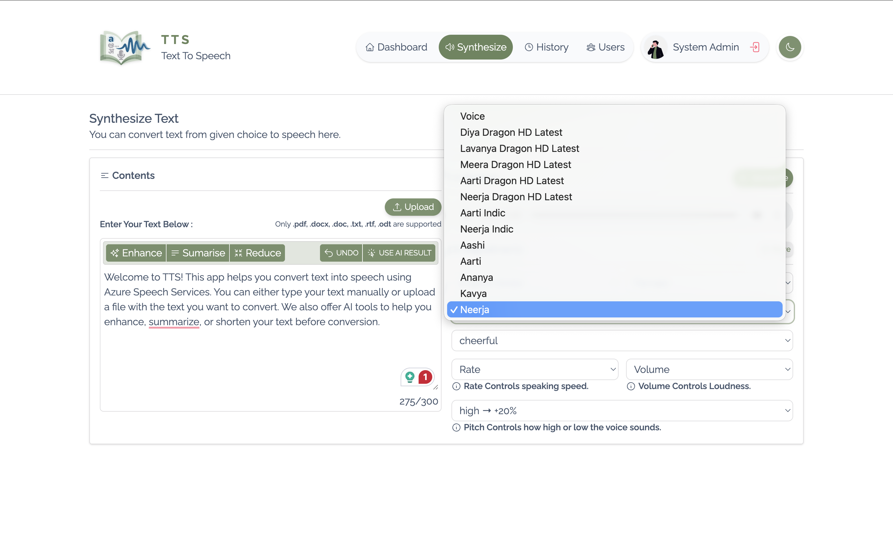

## Synthesis Progress

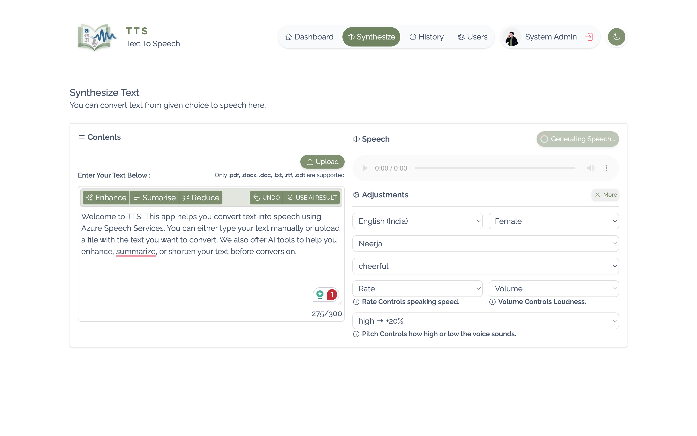

## Synthesis Result

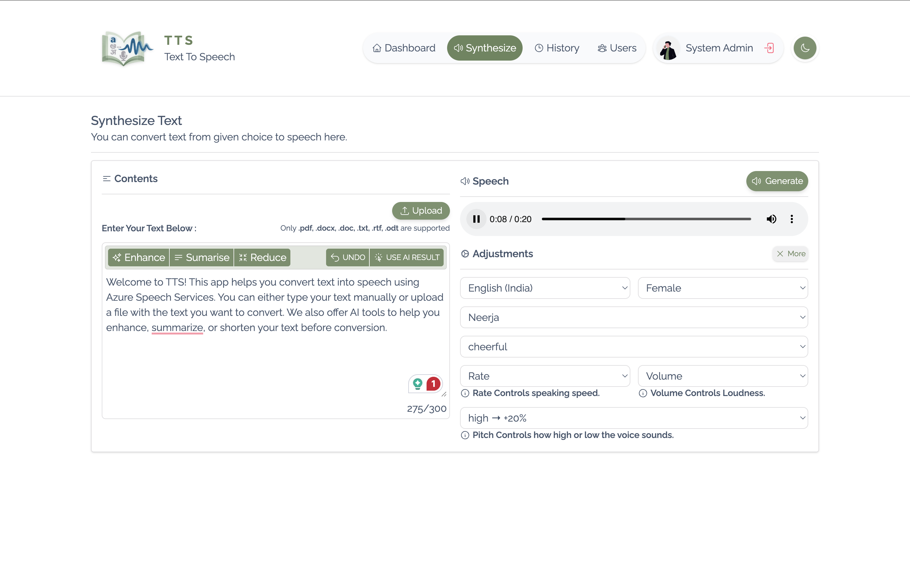

## History

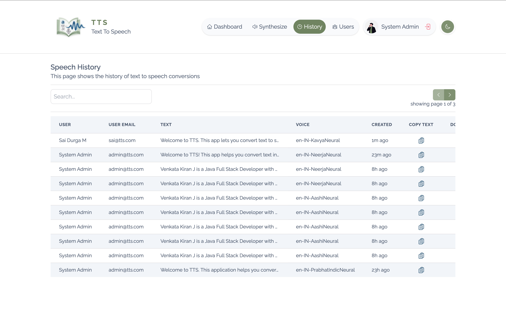

## History Actions

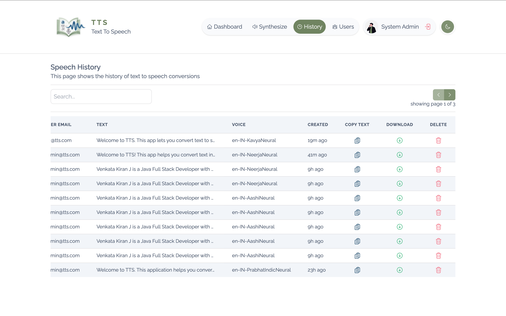

---

# Design Principles

The application follows the following architectural and engineering principles:

- Microservices Architecture
- Separation of Concerns
- Single Responsibility Principle
- Domain-oriented service decomposition
- Loose Coupling
- High Cohesion
- Centralized Configuration
- Service Discovery
- API Gateway Pattern
- Reusable Platform Modules
- Stateless Authentication
- Role-Based Authorization
- Request Context Propagation
- Centralized Logging
- Standardized Exception Handling
- Database per Service
- Separation of Metadata and Binary Storage
- Secure External Service Integration
- Configuration-driven Application Behavior
- RESTful API Design
- Constructor-based Dependency Injection
- Spring Boot Auto-Configuration
- Automated Testing

---

# Future Enhancements

Potential future improvements include:

- Kubernetes deployment
- Containerized deployment
- CI/CD pipeline
- Distributed tracing
- Centralized monitoring
- Additional TTS providers
- Additional AI providers
- Advanced speech customization
- Additional document formats
- Favorite speech records
- Advanced analytics
- Usage dashboards
- Asynchronous speech processing
- Notification support
- Improved audio management
- Horizontal service scaling

---

# License

This project is developed as a full-stack software engineering project demonstrating modern Java, Spring Boot, Spring Cloud, React, microservices architecture, cloud-service integration, and distributed application design.

---

# Author

**Venkata Kiran J** - [Connect with me on LinkedIn](https://www.linkedin.com/in/venkata-kiran-jakkapu-a2209415a/)

Full-Stack Java Developer

- Java
- Spring Boot
- Spring Cloud
- Spring Security
- React
- PostgreSQL
- REST APIs
- Microservices
- Cloud Technologies
- DevOps
